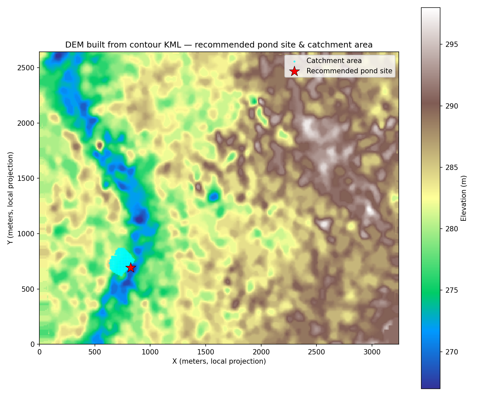

# Village Pond Catchment Analysis Backend — Phase 2

Backend API that accepts a contour map (KML/KMZ), analyzes the terrain, identifies a
suitable pond location, and returns the estimated catchment area draining into it.

Part of: **AI-based Village Pond Planning System** — Assignment 1, Phase 2.

---

## 1. Installation Guide

### Requirements
- Python 3.10+

### Steps
```bash
# 1. Clone the repo
git clone <your-github-repo-url>
cd pond_backend

# 2. Create a virtual environment (recommended)
python -m venv venv
source venv/bin/activate      # on Windows: venv\Scripts\activate

# 3. Install dependencies
pip install -r requirements.txt

# 4. Run the server
uvicorn app.main:app --reload
```

The API will be live at `http://127.0.0.1:8000`.
Interactive Swagger docs are auto-generated at `http://127.0.0.1:8000/docs`.

---

## 2. API Documentation

### `POST /analyzeContour`

Accepts a contour map file and returns the recommended pond location with its
catchment information.

**Request:** `multipart/form-data`
| Field | Type | Description |
|-------|------|--------------|
| `file` | file | A `.kml` or `.kmz` contour map |

**Example (curl):**
```bash
curl -X POST http://127.0.0.1:8000/analyzeContour \
  -F "file=@contours_1m.kml"
```

**Example (Python):**
```python
import requests
files = {"file": open("contours_1m.kml", "rb")}
r = requests.post("http://127.0.0.1:8000/analyzeContour", files=files)
print(r.json())
```

**Response (200 OK):**
```json
{
  "input_file": "contours_1m.kml",
  "processing_time_seconds": 4.44,
  "dem_resolution_meters": 10.0,
  "grid_size": { "rows": 264, "cols": 324 },
  "recommended_pond_location": {
    "longitude": 81.2893,
    "latitude": 21.2461,
    "elevation_m": 268.0
  },
  "catchment": {
    "area_m2": 35700.0,
    "area_hectares": 3.57,
    "num_contributing_cells": 357,
    "elevation_min_m": 268.0,
    "elevation_max_m": 284.88,
    "boundary_polygon_lonlat": [[81.288, 21.245], ["..."]]
  },
  "note": "Runoff volume and rainfall-based storage estimates will be integrated in the next phase using a rainfall API, using this catchment area as the input."
}
```

The full sample response for the provided `contours_1m.kml` is saved in
[`sample_output.json`](./sample_output.json).

### `GET /`
Simple health check — returns `{"status": "ok"}`.

---

## 3. Catchment Estimation Approach

The problem: given only a contour map (lines of equal elevation), figure out where
water naturally collects and how much land area drains into that point.

**Step 1 — Parse the contour file.**
Each contour line in the KML is a `Placemark` with a `LineString`, and its elevation
value is stored in the placemark's `name` (e.g. `"277.0"`). We extract every
(longitude, latitude, elevation) point from every line. (`app/kml_parser.py`)

**Step 2 — Build a DEM (Digital Elevation Model).**
A DEM is just a regular grid of elevation values. We don't have one directly — we
only have scattered elevation samples along contour lines. So:
- Lon/lat is converted to local meters (simple equirectangular projection) so
  distances/areas are physically meaningful.
- `scipy.interpolate.griddata` interpolates the scattered elevation samples onto a
  regular grid (default 10m cells, auto-coarsened for very large maps so the grid
  never gets unreasonably big). (`app/dem_builder.py`)

**Step 3 — D8 Flow Direction.**
For every grid cell, we look at its 8 neighbours and find the one with the steepest
downhill slope — that's the direction water flows from that cell. This is the
standard "D8" algorithm used in hydrology/GIS tools like ArcGIS or QGIS.
(`app/catchment.py :: compute_flow_direction`)

**Step 4 — Flow Accumulation.**
We process cells from highest to lowest elevation, and each cell passes its
accumulated "flow count" downstream to its D8 neighbour. By the time we reach the
lowest cells, we know exactly how many upstream cells' water passes through each
cell — i.e., where water naturally converges.
(`app/catchment.py :: compute_flow_accumulation`)

**Step 5 — Pond Site Selection.**
We pick the cell (away from the map edges, to avoid boundary artifacts) with the
highest flow accumulation — the point where the most water converges naturally.
This is a reasonable, low-lying, high-convergence spot for a pond.
(`app/catchment.py :: select_pond_site`)

**Step 6 — Catchment Delineation.**
Starting from the chosen pond cell, we walk backwards through the flow-direction
graph (a reverse BFS: "which cells eventually flow into this one?") to collect every
contributing cell. Catchment area = number of contributing cells × cell area.
(`app/catchment.py :: delineate_catchment`)

**Step 7 — Return results.**
Pond location, catchment area (m² and hectares), elevation range of the catchment,
and a convex-hull boundary polygon (for map overlay) are returned as JSON.

Nothing about the sample map's coordinates or elevations is hard-coded anywhere —
every number in the response is derived from whatever contour file is uploaded, so
the same code works on any other contour map with the same structure.

---

## 4. Demonstration (Sample Contour Map)

Using the provided `contours_1m.kml` (1-meter contour interval, ~8.5 km² area,
elevation range 267m–298m):

- The API correctly identified a natural drainage valley running through the
  mapped area (visible as the low-elevation blue channel below).
- Recommended pond site: **(81.2893° E, 21.2461° N)** at elevation **268m**
  (near the lowest point in the map).
- Estimated catchment area: **35,700 m² (3.57 hectares)**, made up of 357
  contributing grid cells.


*Blue/green = low elevation (natural drainage valley), cyan = catchment area,
red star = recommended pond site.*

---

## 5. Project Structure

```
pond_backend/
├── app/
│   ├── main.py           # FastAPI app + /analyzeContour route
│   ├── kml_parser.py      # Parses KML/KMZ contour files
│   ├── dem_builder.py     # Builds a DEM grid from contour lines
│   └── catchment.py       # D8 flow direction, accumulation, catchment delineation
├── requirements.txt
├── test_api.py             # Simple script to test the endpoint
├── sample_output.json      # Example response for contours_1m.kml
├── demo_output.png         # Visualization of the demo run
└── README.md
```

## 6. Extensibility to Future Phases

- The DEM and catchment logic doesn't assume anything about the sample map's size,
  location, or elevation range, so it generalizes to any KML/KMZ contour file with
  the same structure (elevation stored in the Placemark name).
- The `catchment.area_m2` value returned here is exactly what the next phase needs
  as input to the Rational Method runoff formula (`Q = C × I × A`) once rainfall
  data is pulled in from a rainfall API.
- KMZ (zipped KML) support is already handled, in case future contour maps are
  provided in that format.

## 7. AI Tool Usage Disclosure

Claude (Anthropic) was used to help design the algorithmic approach (D8 flow
direction/accumulation for catchment delineation), scaffold the FastAPI project
structure, and debug/test the implementation against the provided sample contour
map. All code was reviewed and understood before submission.
